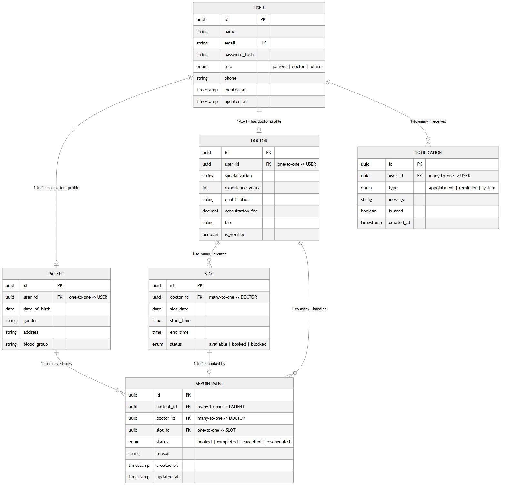
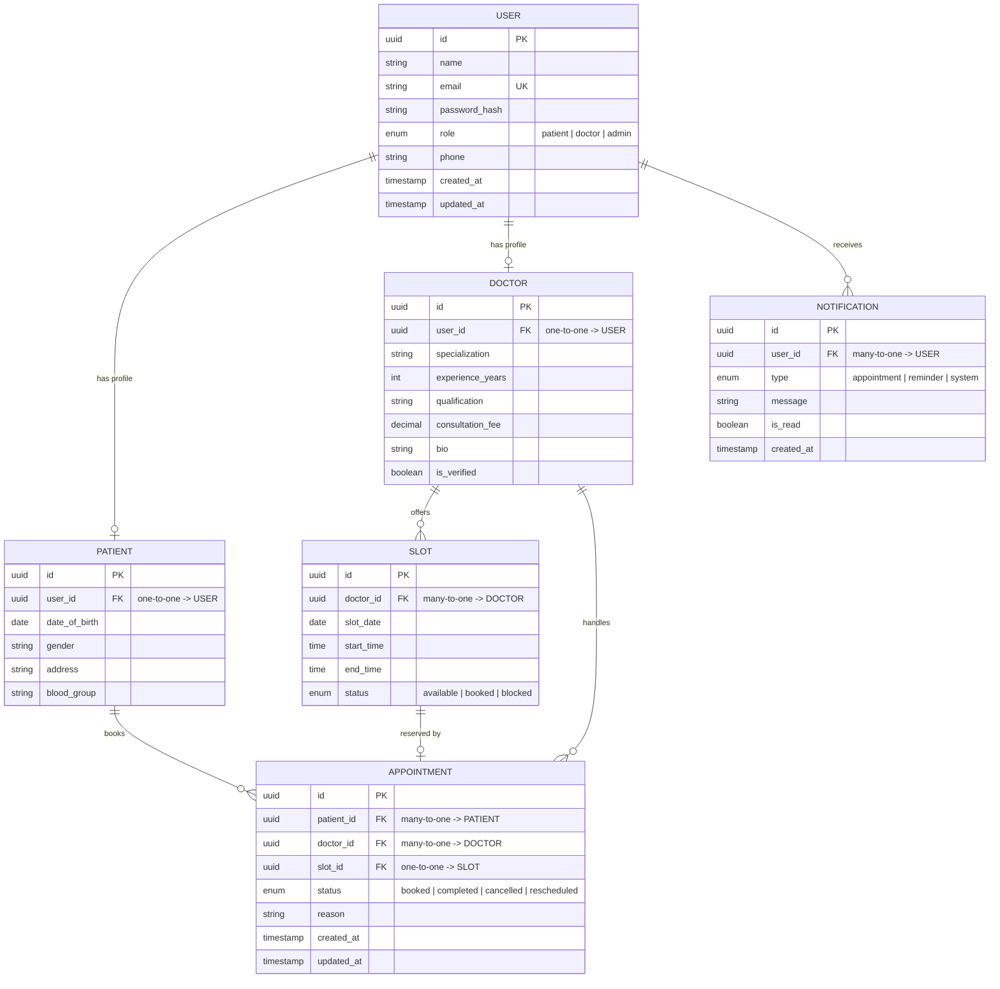

# Schedula — ER Diagram (Day 1)

Entity–Relationship diagram for the **Schedula** doctor-appointment booking system.
The diagram below is written in Mermaid, so it renders automatically on GitHub and in the Pull Request.
A rendered image is also available at [`docs/ERDiagram.png`](docs/ERDiagram.png).

## Rendered image

### How to read this diagram

- Each box is a **table**; its rows are `type` · `column` · `key`.
- **PK** = primary key, **FK** = foreign key, **UK** = unique key.
- Line labels state the relationship in plain words, e.g. `1-to-1 · has doctor profile`, `1-to-many · books`.
- **1-to-1**: a row on each side links to at most one row on the other (e.g. a User has one Doctor profile).
- **1-to-many**: one row links to many rows on the other side (e.g. one Doctor creates many Slots).

## Diagram

## Entities & Relationships

| Entity | Purpose |
| --- | --- |
| **User** | Base account for authentication (email/password) and role. Every patient and doctor is a User. |
| **Patient** | Patient-specific profile; extends a User via a one-to-one link. |
| **Doctor** | Doctor-specific profile (specialization, fee, etc.); extends a User via a one-to-one link. |
| **Slot** | A bookable time window created by a Doctor for their availability. |
| **Appointment** | A booking made by a Patient with a Doctor for a specific Slot. |
| **Notification** | Messages/reminders delivered to a User (booking confirmed, reminder, etc.). |

### Relationship summary

- **User ⟷ Patient** — one-to-one (a user account maps to at most one patient profile).
- **User ⟷ Doctor** — one-to-one (a user account maps to at most one doctor profile).
- **User → Notification** — one-to-many (a user receives many notifications).
- **Doctor → Slot** — one-to-many (a doctor publishes many availability slots).
- **Doctor → Appointment** — one-to-many (a doctor handles many appointments).
- **Patient → Appointment** — one-to-many (a patient books many appointments).
- **Slot ⟷ Appointment** — one-to-one (a slot is reserved by at most one appointment).

### Foreign keys

- `PATIENT.user_id → USER.id`
- `DOCTOR.user_id → USER.id`
- `SLOT.doctor_id → DOCTOR.id`
- `APPOINTMENT.patient_id → PATIENT.id`
- `APPOINTMENT.doctor_id → DOCTOR.id`
- `APPOINTMENT.slot_id → SLOT.id`
- `NOTIFICATION.user_id → USER.id`
